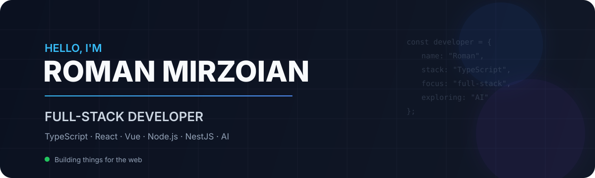

---

## 🚀 About Me

I'm a **Full-Stack Developer** with a strong frontend background and hands-on experience building production web applications.

My primary stack is **TypeScript, React and Node.js**, with experience across both frontend architecture and backend services.

* 🧩 Building full-stack applications from **UI to API and database**
* ⚙️ Designing **REST APIs, backend services and microservice-based systems**
* 🏗️ Working with **React, Vue, Node.js and NestJS**
* 🗄️ Using **MongoDB and PostgreSQL** for data-intensive applications
* 🐳 Containerizing and deploying applications with **Docker & AWS**
* 🤖 Exploring **LLMs, RAG, AI agents and agentic workflows**
* 🌍 Open to **remote opportunities**

---

## 🛠️ Tech Stack

### Languages

  

### Frontend

  

### Backend

  

### Databases & Infrastructure

  

---

## 💻 Featured Projects

### 🤖 AI Customer Assistant

AI-powered Telegram assistant designed to handle customer questions using a structured knowledge base and LLMs.

**Focus:** `TypeScript` `Node.js` `Telegram Bot API` `LLM` `RAG`

---

### 💰 Telegram Expense Tracker

A Telegram-based personal and family expense management application.

**Features:**

* Shared family expenses
* Customizable categories
* Multi-currency support
* Currency conversion
* Expense reports
* AI-powered expense parsing

**Stack:** `TypeScript` `Node.js` `Telegraf` `MongoDB`

---

### ⚡ Real-Time Quiz Application

A real-time multiplayer quiz application with synchronized game state and live communication.

**Stack:** `React` `TypeScript` `Node.js` `Express` `Socket.IO` `SQLite`

---

## 🤖 Currently Exploring

I'm currently expanding my experience in **AI Engineering** and modern LLM-based application development.

Areas I'm exploring:

`LLM APIs` · `RAG` · `Tool Calling` · `AI Agents` · `Agentic Workflows` · `Multi-Agent Systems`

My goal is to combine my existing **full-stack engineering experience** with practical AI-powered product development.

---

## 📊 GitHub

---

### 💬 Let's build something useful.

**Full-Stack Development · AI · Web Applications**

<!--
**roman-mirzoian/roman-mirzoian** is a ✨ _special_ ✨ repository because its `README.md` (this file) appears on your GitHub profile.

Here are some ideas to get you started:

- 🔭 I’m currently working on ...
- 🌱 I’m currently learning ...
- 👯 I’m looking to collaborate on ...
- 🤔 I’m looking for help with ...
- 💬 Ask me about ...
- 📫 How to reach me: ...
- 😄 Pronouns: ...
- ⚡ Fun fact: ...
-->
